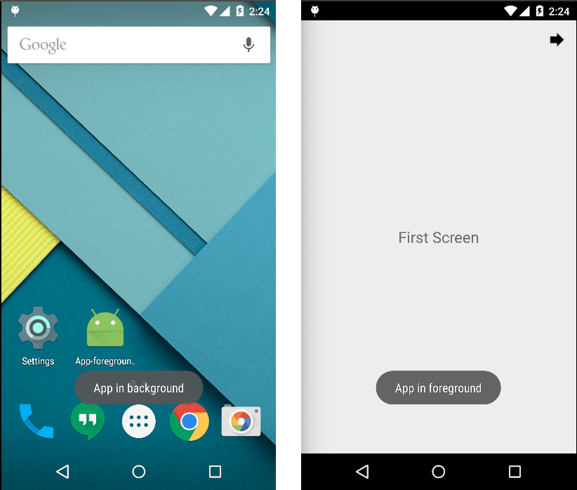

# app-foreground-background-listen
You can detect when your whole application come to foreground and background using this very simple logic and for all android API level.

# Usage
- You can use with any android API level.
- Create a BaseActivity for all Activity in your application.
- You can also use onStart() and onStop() of method of Activty seperately from BaseActivity.

public class BaseActivity extends Activity {

    public void onCreate(Bundle savedInstanceState) {

        super.onCreate(savedInstanceState);
        setRequestedOrientation(ActivityInfo.SCREEN_ORIENTATION_PORTRAIT);
    }

    public static boolean isAppInFg = false;
    public static boolean isScrInFg = false;
    public static boolean isChangeScrFg = false;

    @Override
    protected void onStart() {
        if (!isAppInFg) {
            isAppInFg = true;
            isChangeScrFg = false;
            onAppStart();
        } else {
            isChangeScrFg = true;
        }
        isScrInFg = true;

        super.onStart();
    }

    @Override
    protected void onStop() {
        super.onStop();

        if (!isScrInFg || !isChangeScrFg) {
            isAppInFg = false;
            onAppPause();
        }
        isScrInFg = false;
    }

    public void onAppStart() {
        //remove this toast
        Toast.makeText(getApplicationContext(), "App in foreground", Toast.LENGTH_LONG).show();
        // your code
    }

    public void onAppPause() {
        //remove this toast
        Toast.makeText(getApplicationContext(), "App in background", Toast.LENGTH_LONG).show();
        // your code
    }
}

- Now use this BaseActivity as a super class of all you Activity like
<b>MainActivity extends BaseActivity</b>
and 
<b>onAppStart</b>
will be called when you starts your app and 
<b>onAppPause() </b>
will be called when app goes background from any screen.

